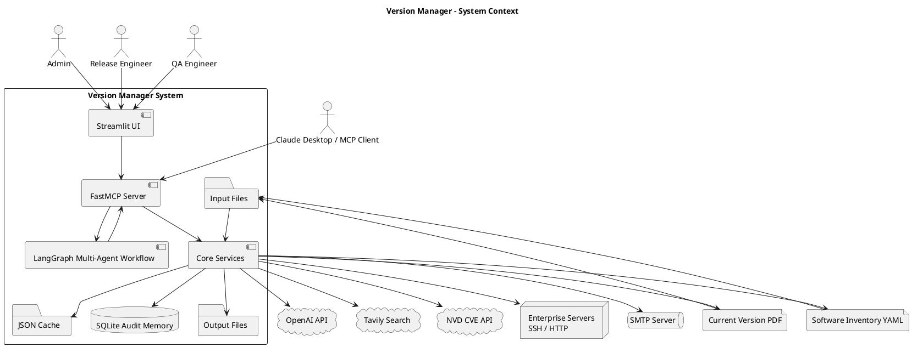
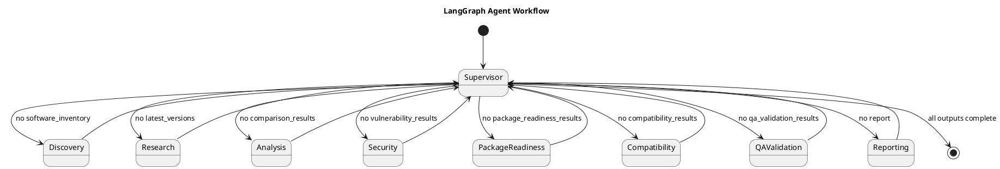
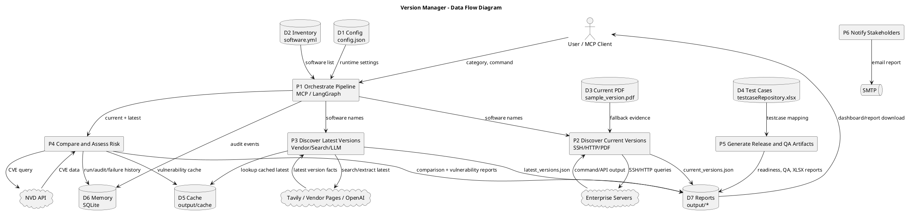
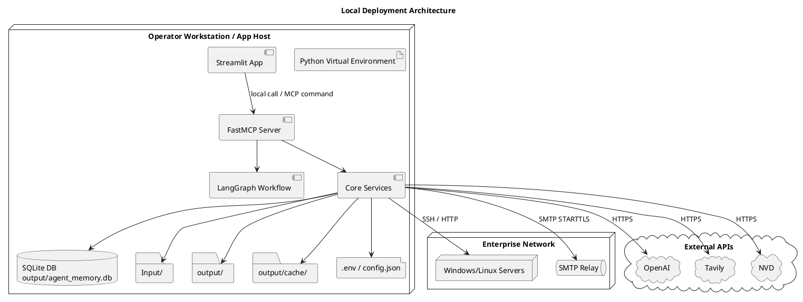
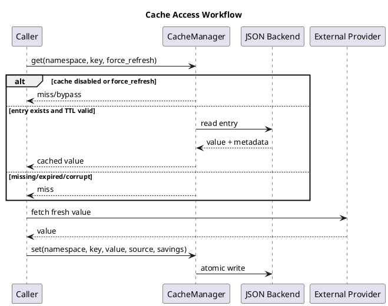

# Software Design Document and Architecture Document

## Version Manager: LangGraph + MCP Multi-Agent System

| Document Attribute | Value |
|---|---|
| System | Version Manager |
| Architecture Style | MCP tool server, LangGraph multi-agent orchestration, Streamlit operator UI |
| Primary Runtime | Python |
| Document Type | Enterprise Software Design Document (SDD) and Architecture Document |
| Diagram Standard | PlantUML and text-based diagrams; Mermaid is intentionally not used |
| Repository Scope | `streamlit_app.py`, `App/pages/`, `App/data_loaders.py`, `App/workflow_actions.py`, `App/workflow_ui.py`, `mcp_server.py`, `agent/`, `Core/`, `Utils/`, `tests/`, `Input/`, `output/` |

## 1. Executive Summary

Version Manager is an enterprise automation platform that discovers installed software versions, researches latest vendor versions, compares version drift, evaluates vulnerability and readiness risk, generates release/QA artifacts, and sends stakeholder notifications. The system exposes atomic capabilities as Model Context Protocol (MCP) tools and orchestrates them through deterministic pipelines, a LangGraph multi-agent workflow, and an optional ReAct-style agent loop.

The solution is designed for enterprise release engineering, security operations, QA planning, and infrastructure compliance use cases. It integrates with live servers over SSH or HTTP, PDF-based fallback inventory documents, vendor/search data through Tavily and OpenAI, NVD vulnerability intelligence, Excel reporting, SMTP notifications, a Streamlit UI, APScheduler automation, JSON file outputs, JSON cache storage, and SQLite audit memory.

## 2. Goals and Scope

### 2.1 Business Goals

- Automate recurring software version compliance checks.
- Detect version drift between installed and latest vendor releases.
- Support security risk triage using NVD CVE data and local policy rules.
- Produce audit-ready reports for release, security, QA, and application owners.
- Reduce manual lookup effort through caching and scheduled execution.
- Provide a tool-based architecture usable by Claude Desktop, agents, Streamlit, and future enterprise integrations.

### 2.2 In Scope

- Software inventory loading from YAML.
- Current version discovery from live servers and PDF fallback.
- Latest version discovery from authoritative vendor pages, Tavily search, and OpenAI extraction.
- Version comparison and update decisioning.
- Vulnerability assessment through NVD and local fallback logic.
- Security policy enrichment.
- Package readiness, compatibility, QA validation, and test case impact generation.
- Excel, JSON, text, HTML email, and audit outputs.
- MCP tool exposure.
- LangGraph multi-agent workflow.
- Scheduled execution using cron configuration.
- Role-aware Streamlit operations.
- Caching, logging, retries, audit memory, and operational observability.

### 2.3 Out of Scope

- Automated production patch deployment.
- Automated rollback execution.
- Full enterprise identity provider integration.
- Centralized SIEM/SOAR integration, though the architecture supports it as a future enhancement.
- Distributed multi-node execution, though the architecture can evolve toward it.

## 3. System Context

The Version Manager sits between enterprise users, agent clients, local configuration, infrastructure endpoints, external intelligence services, and reporting channels.



## 4. Architecture Overview

### 4.1 Logical Architecture

```plantuml
@startuml
title Version Manager - Logical Architecture

package "Presentation and Clients" {
  [Streamlit App\nstreamlit_app.py] as Streamlit
  [Claude Desktop / MCP Host] as Claude
  [CLI Runner\nrun_agent_mcp.py] as CLI
}

package "Tool and Orchestration Layer" {
  [FastMCP Tool Server\nmcp_server.py] as MCP
  [APScheduler\nCron Pipeline] as Scheduler
  [LangGraph Workflow\nagent/multi_agent.py] as LangGraph
  [ReAct Agent\nagent/agent.py] as ReAct
}

package "Core Domain Services" {
  [VersionFetcher] as VersionFetcher
  [ServerQuerier] as ServerQuerier
  [PDFReader] as PDFReader
  [Comparator] as Comparator
  [VulnerabilityChecker] as VulnerabilityChecker
  [SecurityPolicy] as SecurityPolicy
  [WorkspaceAssessment] as WorkspaceAssessment
  [TestcaseImpact] as TestcaseImpact
  [ExcelReporter] as ExcelReporter
  [Notifier] as Notifier
  [Reliability + Observability] as Reliability
}

package "Persistence and Configuration" {
  database "SQLite\nagent_memory.db" as SQLite
  folder "JSON Output\noutput/*.json" as JsonOutput
  folder "JSON Cache\noutput/cache" as JsonCache
  file "config.json" as Config
  file "software.yml" as SoftwareYml
  file "sample_version.pdf" as VersionPdf
  file "testcaseRepository.xlsx" as TestRepo
}

package "External Integrations" {
  cloud "OpenAI" as OpenAI
  cloud "Tavily" as Tavily
  cloud "NVD API" as Nvd
  node "SSH / HTTP Servers" as Servers
  queue "SMTP" as Smtp
}

Streamlit --> Pages
Pages --> MCP
Streamlit --> MCP
Claude --> MCP
CLI --> ReAct
MCP --> Scheduler
MCP --> LangGraph
MCP --> VersionFetcher
MCP --> ServerQuerier
MCP --> PDFReader
MCP --> Comparator
MCP --> VulnerabilityChecker
MCP --> WorkspaceAssessment
MCP --> TestcaseImpact
MCP --> ExcelReporter
MCP --> Notifier
LangGraph --> MCP
ReAct --> MCP

VersionFetcher --> OpenAI
VersionFetcher --> Tavily
VersionFetcher --> JsonCache
VersionFetcher --> Config
ServerQuerier --> Servers
PDFReader --> VersionPdf
Comparator --> JsonOutput
VulnerabilityChecker --> Nvd
VulnerabilityChecker --> JsonCache
VulnerabilityChecker --> SecurityPolicy
WorkspaceAssessment --> TestRepo
ExcelReporter --> JsonOutput
Notifier --> Smtp
Reliability --> JsonOutput
MCP --> SQLite
@enduml
```



### 4.2 Primary Runtime Flow

1. A user, scheduled job, or MCP client invokes a pipeline or individual MCP tool.
2. The MCP server loads current configuration, initializes reusable services, and records audit/observability events.
3. The discovery step loads the software list and resolves installed versions from live servers, falling back to PDF extraction when live discovery fails.
4. The research step resolves latest vendor versions through direct vendor lookup where available, Tavily search, OpenAI extraction, and cache reuse.
5. The analysis step compares latest and current versions and records run history.
6. The security step queries NVD or local fallback logic, then applies enterprise policy enrichment.
7. Readiness, compatibility, QA validation, and test case impact steps create additional release artifacts.
8. Reporting generates JSON, Excel, plain-text, HTML, and email outputs.
9. Audit records, logs, cache metrics, and run history are persisted for traceability.

## 5. Technology Stack

| Layer | Technology | Purpose |
|---|---|---|
| UI | Streamlit, Altair | Operator dashboard, configuration, reports, charts |
| MCP Server | `mcp.server.fastmcp.FastMCP` | Tool exposure to MCP clients and agents |
| Agent Orchestration | LangGraph | Supervisor-routed, stateful multi-agent workflow |
| LLM Integration | OpenAI Async client | Structured extraction and agent reasoning |
| Web Search | Tavily, LangChain Tavily | Latest vendor version discovery |
| HTTP Client | httpx | Vendor/NVD/API calls |
| Remote Execution | Paramiko | SSH current-version discovery |
| PDF Parsing | pdfminer.six, pdfplumber | Current-version fallback extraction |
| Scheduling | APScheduler | Cron-based background pipeline |
| Persistence | SQLite, JSON files | Audit/run memory and report artifacts |
| Caching | Thread-safe JSON cache | TTL-based reuse of expensive lookups |
| Reporting | pandas, openpyxl | Enterprise Excel reports |
| Notifications | SMTP, MIME email | Plain-text and HTML stakeholder notifications |
| Testing | pytest | Unit and integration-style validation |

## 6. Component Design

### 6.1 Streamlit UI Shell and Page Package

| Attribute | Description |
|---|---|
| Shell | `streamlit_app.py` |
| Page Package | `App/pages/` |
| Purpose | Provides an interactive operator interface for admins, release engineers, and QA users while keeping the Streamlit entry point thin and maintainable. |
| Shell Responsibilities | Page configuration, authentication gate, schedule synchronization, data loading orchestration, page routing, and construction of the shared `page_context()` adapter. |
| Page Responsibilities | Role-specific UI screens, Streamlit widgets, page-level actions, tables, charts, report previews, QA signoff, scanner upload, user management, and cache/audit views. |
| Technologies | Streamlit, Altair, pandas, modular Python page modules, local project services. |
| Inputs | User credentials, role selection, team/release context, refresh controls, uploaded files, local output artifacts. |
| Outputs | Dashboards, charts, tables, report previews, operational status indicators, QA updates, scanner findings, user administration changes. |
| Integrations | `App/data_loaders.py`, `App/workflow_actions.py`, `App/workflow_ui.py`, `config.json`, scoped `output/`, generated Excel/JSON artifacts. |
| Communication | Local Python calls through a narrow page context. Future deployment can move this boundary to authenticated HTTP/MCP calls. |

Current page package layout:

| Module | Responsibility |
|---|---|
| `App/pages/context.py` | Team and product release selector used by dashboard and operations pages. |
| `App/pages/dashboard.py` | Dashboard, software inventory, latest versions, version comparison, package readiness, and compatibility check. |
| `App/pages/operations.py` | Manual workflow actions, schedule controls, role workflow execution, and operation summaries. |
| `App/pages/qa_validation.py` | QA validation dashboard, manual QA update, evidence upload, QA completion signoff, and signoff history. |
| `App/pages/security.py` | Vulnerability assessment, uploaded scanner report parsing, security heatmap, and review queue. |
| `App/pages/admin.py` | Audit logs, settings, admin user management, release input upload, and cache analytics. |
| `App/pages/reports.py` | Report package download and HTML email preview. |
| `App/pages/support.py` | Shared page helpers for posture cards, output visibility, and operation result rendering. |

Workflow:

1. User authenticates using configured local users.
2. `streamlit_app.py` reads active configuration and scoped output artifacts through `App/data_loaders.py`.
3. Role-aware navigation is built by `App/navigation.py`, including QA Validation for Admin and QA Engineer roles.
4. The selected page module renders its UI using `page_context()` for shared services and UI helpers.
5. Page modules call `App/workflow_actions.py` for workflow side effects and service modules for focused operations.
6. UI displays comparison, vulnerability, readiness, QA, report, cache, and audit metrics.

### 6.2 Streamlit Supporting Modules

| Module | Purpose | Notes |
|---|---|---|
| `App/data_loaders.py` | Loads JSON/text/metrics files and normalizes current, latest, comparison, vulnerability, package readiness, QA validation, and test impact data. | Keeps data shaping testable outside Streamlit pages. |
| `App/workflow_actions.py` | Executes shared scans, role workflows, individual fetch/compare actions, email sending, and vendor compatibility resolution. | Separates side-effect actions from UI rendering. |
| `App/workflow_ui.py` | Renders Workflow Monitor and planner/verifier status. | Admin-only navigation entry. |
| `App/layout.py` | CSS injection, header, section title, access-denied UI, and visual helper functions. | Centralizes presentation primitives. |
| `App/navigation.py` | Role-aware page list and sidebar rendering. | Inserts QA Validation for Admin and QA Engineer roles. |
| `App/ui_components.py` | Shared operational tables, searchable tables, bar charts, donut charts, and readable cell styling. | Avoids repeated UI table/chart code. |

### 6.2 FastMCP Tool Server (`mcp_server.py`)

| Attribute | Description |
|---|---|
| Purpose | Central tool facade and application runtime. |
| Responsibilities | Exposes atomic MCP tools, initializes shared services, manages scheduler lifecycle, resolves paths consistently, persists JSON artifacts, coordinates deterministic full pipeline. |
| Technologies | FastMCP, APScheduler, Python async, project Core services. |
| Inputs | MCP tool arguments, `config.json`, `Input/software.yml`, current-version PDF, external service responses. |
| Outputs | JSON strings to MCP clients, files in `output/`, email notifications, audit records. |
| Integrations | Core modules, LangGraph workflow, scheduler, SQLite memory, SMTP, NVD, Tavily, OpenAI, enterprise servers. |
| Communication | MCP tool protocol with clients; direct Python service calls internally. |

Exposed MCP tools:

| Tool | Purpose | Primary Input | Primary Output |
|---|---|---|---|
| `get_software_list` | Return software names by category | `category` | Software list JSON |
| `query_server` | Query live server version | `software_name` | Current version JSON |
| `extract_from_pdf` | Extract current version from PDF fallback | `software_name` | Current version JSON |
| `search_latest_version` | Discover latest vendor version | `software_name`, `force_refresh` | Latest version JSON |
| `fetch_latest_versions` | Batch latest-version discovery | `category`, `force_refresh` | Latest versions file/result |
| `fetch_current_versions` | Batch current-version discovery | `category` | Current versions file/result |
| `compare_versions` | Compare latest/current versions | Optional latest/current dictionaries | Comparison report |
| `get_run_history` | Return recent run history | `software_name`, `limit` | History rows |
| `check_vulnerabilities` | Assess CVE/security risk | Software, version, update status | Vulnerability finding |
| `save_vulnerability_report` | Persist vulnerability report | Vulnerability dictionary | File metadata |
| `generate_excel_assessment` | Create enterprise Excel assessment | Existing JSON outputs | XLSX metadata |
| `assess_package_readiness` | Build release/package readiness | Comparison/latest/vulnerabilities | Readiness JSON |
| `check_compatibility` | Create compatibility assessment | Comparison/readiness | Compatibility JSON |
| `generate_qa_validation` | Create QA validation plan | Comparison/readiness | QA JSON |
| `save_package_readiness` | Persist package readiness | Readiness dictionary | File metadata |
| `save_qa_validation` | Persist QA validation | QA dictionary | File metadata |
| `generate_testcase_impact` | Map impacted test cases | Comparison | JSON/XLSX impact outputs |
| `send_notification` | Send stakeholder report | Optional report body | Email status |
| `log_audit_event` | Persist audit step | Step/details | Audit metadata |
| `run_full_pipeline` | Execute full deterministic pipeline | `category`, `force_refresh` | Full pipeline result |

### 6.3 LangGraph Multi-Agent Workflow (`agent/multi_agent.py`)

| Attribute | Description |
|---|---|
| Purpose | Provides explicit multi-agent orchestration with stateful routing and least-privilege tool access. |
| Responsibilities | Supervisor routing, specialized step execution, shared state updates, audit logging, report package creation. |
| Technologies | LangGraph `StateGraph`, Python async, typed state dictionaries. |
| Inputs | User request, category, force-refresh flag, MCP tool map. |
| Outputs | Final `VersionManagerState`, report package, audit history, generated artifacts. |
| Integrations | MCP tool callables, SQLite memory, Core notifier/report utilities. |
| Communication | Agents exchange data only by returning partial updates to shared graph state. External work is delegated to allowed MCP tools. |

Agent responsibilities:

| Agent | Responsibilities | Allowed Tools |
|---|---|---|
| Supervisor | Determines next step based on state completeness | None |
| Discovery | Loads software list; resolves current version from server or PDF | `get_software_list`, `query_server`, `extract_from_pdf` |
| Research | Retrieves latest version metadata | `search_latest_version` |
| Analysis | Compares latest/current and records run history | `compare_versions`, `get_run_history` |
| Security | Checks vulnerabilities and saves security report | `check_vulnerabilities`, `save_vulnerability_report` |
| Package Readiness | Produces release package readiness data | `assess_package_readiness`, `save_package_readiness` |
| Compatibility | Evaluates compatibility requirements | `check_compatibility` |
| QA Validation | Builds QA validation and test case impact | `generate_qa_validation`, `save_qa_validation`, `generate_testcase_impact` |
| Reporting | Builds final report, Excel, email, and audit record | `generate_excel_assessment`, `send_notification`, `log_audit_event` |

Agent workflow diagram:



### 6.4 ReAct Agent (`agent/agent.py`)

| Attribute | Description |
|---|---|
| Purpose | Optional open-ended reasoning orchestrator using OpenAI tool calling. |
| Responsibilities | Build tool schemas, invoke OpenAI, process tool calls, cap execution at `MAX_STEPS`, record audit/failure events. |
| Technologies | OpenAI Async client, function/tool calling, SQLite memory. |
| Inputs | Goal, category, tool map. |
| Outputs | Summary with run ID, steps, needs-update list, email status, comparison report. |
| Integrations | Injected async tools, audit memory, OpenAI. |
| Communication | LLM-driven tool selection through OpenAI chat completion messages. |

Enterprise recommendation: the LangGraph workflow should be the preferred production orchestration path because it is deterministic, auditable, and least-privilege by design. The ReAct agent remains useful for experimentation and conversational operation.

### 6.5 Version Fetcher (`Core/version_fetcher.py`)

| Attribute | Description |
|---|---|
| Purpose | Discovers latest vendor software versions. |
| Responsibilities | Direct authoritative lookup for known vendors, Tavily search, OpenAI extraction, deterministic parsing/repair, cache reuse. |
| Technologies | httpx, Tavily, OpenAI client wrapper, JSON cache, regex parsing. |
| Inputs | Software name, force-refresh flag, API keys, cache config. |
| Outputs | `{Build Version, Cumulative Update (CU), cache_metadata}`. |
| Integrations | Microsoft Learn for SQL Server, Tavily, OpenAI, cache manager. |
| Communication | Async service calls, cache reads/writes, structured dictionary return. |

Workflow:

1. Refresh runtime configuration if `config.json` changed.
2. Check `software_versions` cache.
3. Try authoritative vendor lookup for supported software.
4. Search Tavily for latest version information.
5. Ask OpenAI to extract build/CU in a constrained two-line format.
6. Parse and repair CU data where source text supports it.
7. Persist result to cache and return.

### 6.6 Server Querier (`Core/server_querier.py`)

| Attribute | Description |
|---|---|
| Purpose | Discovers installed software versions from live infrastructure. |
| Responsibilities | Load release/team/global server YAML through `App/server_config.py`, execute SSH commands, call HTTP APIs, parse software-specific versions. |
| Technologies | Paramiko, httpx, asyncio threads, regex. |
| Inputs | Software name and server configuration from `Input/teams/<team>/releases/<release>/servers.yml`, `Input/teams/<team>/servers.yml`, or `Input/servers.yml`. |
| Outputs | Current version dictionary with `source: live server`. |
| Integrations | Enterprise Linux/Windows servers, HTTP endpoints. |
| Communication | SSH command execution or HTTP GET. |

### 6.7 PDF Reader (`Core/pdf_reader.py`)

| Attribute | Description |
|---|---|
| Purpose | Provides deterministic fallback current-version extraction from PDF inventory documents. |
| Responsibilities | Parse tables, line/prose text, and key-value blocks; normalize vendor prefixes; return source strategy. |
| Technologies | pdfplumber, pdfminer.six, regex. |
| Inputs | Current-version PDF path and software name. |
| Outputs | Current version dictionary with fallback source. |
| Integrations | `Input/sample_version.pdf` or configured PDF path. |
| Communication | Local file read and structured dictionary return. |

### 6.8 Comparator (`Core/comparator.py`)

| Attribute | Description |
|---|---|
| Purpose | Determines whether software needs update. |
| Responsibilities | Compare build and CU values, handle unknown values, preserve current source, flag drift. |
| Technologies | Python dictionary processing. |
| Inputs | Latest version map and current version map. |
| Outputs | Per-software comparison report. |
| Integrations | MCP `compare_versions`, reporting, readiness, QA, vulnerability workflow. |
| Communication | Pure function return; file persistence handled by MCP server. |

### 6.9 Vulnerability Checker (`Core/vulnerability_checker.py`)

| Attribute | Description |
|---|---|
| Purpose | Assesses security exposure for installed software versions. |
| Responsibilities | Query NVD, parse CVSS/CVE metadata, classify severity/risk, fallback to local assessment, cache results. |
| Technologies | httpx, NVD CVE API 2.0, JSON cache. |
| Inputs | Software name, version, needs-update flag, force-refresh flag. |
| Outputs | Risk level, severity, CVEs, critical CVEs, assessment text, source metadata. |
| Integrations | NVD API, cache manager, security policy. |
| Communication | Async HTTP calls and structured dictionary return. |

### 6.10 Security Policy (`Core/security_policy.py`, `Core/policy.py`)

| Attribute | Description |
|---|---|
| Purpose | Adds enterprise governance and approval controls. |
| Responsibilities | Enrich vulnerability findings with policy findings; block medium-risk email actions unless approved by policy. |
| Technologies | Python policy functions and exception handling. |
| Inputs | Vulnerability findings, current/latest versions, action request. |
| Outputs | Policy-enriched findings or `PolicyError`. |
| Integrations | Notifier, vulnerability workflow. |
| Communication | Direct function calls. |

### 6.11 Workspace Assessment, Package Readiness, Compatibility, QA, and Test Case Impact

| Attribute | Description |
|---|---|
| Purpose | Converts version/security findings into release engineering and QA planning artifacts. |
| Responsibilities | Build package readiness, compatibility assessment, QA validation plan, test case impact mapping, and output files. |
| Technologies | Python data processing, pandas/openpyxl for Excel test impact outputs. |
| Inputs | Comparison report, latest versions, vulnerabilities, testcase repository XLSX. |
| Outputs | Readiness JSON, compatibility JSON, QA validation JSON, test impact JSON/XLSX. |
| Integrations | `Input/testcaseRepository.xlsx`, `output/` artifacts, Excel reporter. |
| Communication | MCP tool calls and file outputs. |

### 6.12 Excel Reporter (`Core/excel_reporter.py`)

| Attribute | Description |
|---|---|
| Purpose | Generates enterprise consumable workbook output. |
| Responsibilities | Combine assessment data into structured Excel reports. |
| Technologies | pandas, openpyxl. |
| Inputs | JSON output artifacts and configured output path. |
| Outputs | `output/Software_Version_Assessment.xlsx`. |
| Integrations | Reporting agent, MCP tool server, Streamlit UI. |
| Communication | Local file reads/writes. |

### 6.13 Notifier (`Core/notifier.py`)

| Attribute | Description |
|---|---|
| Purpose | Builds and sends stakeholder reports. |
| Responsibilities | Build plain-text and Outlook-friendly HTML reports, calculate summary posture, identify priority updates, enforce send policy, send SMTP email. |
| Technologies | SMTP, MIME multipart email, HTML templates. |
| Inputs | Comparison report, vulnerability report, SMTP config. |
| Outputs | Email sent status, last email error, report body. |
| Integrations | SMTP server, policy engine, reporting agent. |
| Communication | SMTP over STARTTLS. |

### 6.14 Cache Manager (`Core/cache.py`)

| Attribute | Description |
|---|---|
| Purpose | Reduces cost, latency, and rate-limit exposure for external lookups. |
| Responsibilities | TTL-based get/set, namespace isolation, force-refresh bypass, hit/miss/bypass metrics, atomic JSON writes. |
| Technologies | JSON files, SHA-256 cache keys, thread locks. |
| Inputs | Namespace, cache key, TTL config, value payload. |
| Outputs | Cached values, cache metadata, cache metrics JSON. |
| Integrations | VersionFetcher, VulnerabilityChecker. |
| Communication | Local file I/O under `output/cache`. |

### 6.15 Memory and Audit (`agent/memory.py`)

| Attribute | Description |
|---|---|
| Purpose | Stores operational memory for traceability and drift analysis. |
| Responsibilities | Initialize SQLite schema, save run results, log audit events, log failures, return baselines/history/recent failures. |
| Technologies | SQLite. |
| Inputs | Run IDs, software name, version fields, actor, payload, failure reason. |
| Outputs | Queryable audit/run/failure records. |
| Integrations | MCP server, LangGraph workflow, ReAct agent, reporting. |
| Communication | Local SQLite database at `output/agent_memory.db`. |

## 7. Data Design

### 7.1 Input Data

| Input | Format | Source | Purpose |
|---|---|---|---|
| `config.json` | JSON | Local configuration | API keys, schedule, SMTP, cache, users, input/output paths |
| `Input/teams/<team>/releases/<release>/servers.yml` | YAML | Release infrastructure inventory | SSH/HTTP server targets and command definitions |
| `Input/software.yml` | YAML | Application inventory | Defines software categories and software names |
| `Input/sample_version.pdf` | PDF | Current-state evidence | Fallback installed-version source |
| `Input/testcaseRepository.xlsx` | XLSX | QA repository | Maps software changes to validation test cases |

### 7.2 Output Data

| Output | Format | Purpose |
|---|---|---|
| `output/latest_versions.json` | JSON | Latest vendor version results |
| `output/current_versions.json` | JSON | Installed current version results |
| `output/comparison_report.json` | JSON | Version drift decisions |
| `output/vulnerability_report.json` | JSON | CVE/security findings |
| `output/package_readiness.json` | JSON | Release/package readiness |
| `output/qa_validation.json` | JSON | QA validation plan |
| `output/testcase_impact.json` | JSON | Test impact mapping |
| `output/Test_Case_Impact_Assessment.xlsx` | XLSX | QA-facing test impact workbook |
| `output/Software_Version_Assessment.xlsx` | XLSX | Enterprise assessment workbook |
| `output/cache/*` | JSON | Cache entries and metrics |
| `output/agent_memory.db` | SQLite | Audit, run history, failure history |

### 7.3 Data Flow Diagram



## 8. Key Runtime Sequences

### 8.1 Full Pipeline Sequence

```plantuml
@startuml
title Full Version Assessment Pipeline

actor User
participant "MCP Server" as MCP
participant "Software Loader" as Loader
participant "ServerQuerier" as Server
participant "PDFReader" as PDF
participant "VersionFetcher" as Fetcher
participant "Comparator" as Compare
participant "VulnerabilityChecker" as Vuln
participant "Assessment Services" as Assess
participant "ExcelReporter" as Excel
participant "Notifier" as Notify
database "SQLite Memory" as DB
folder "Output Files" as Output

User -> MCP : run_full_pipeline(category, force_refresh)
MCP -> Loader : load_software(category)
Loader --> MCP : software names
loop each software
  MCP -> Server : fetch(software)
  alt live version found
    Server --> MCP : current version
  else server unavailable or no version
    MCP -> PDF : fetch(software)
    PDF --> MCP : fallback current version
  end
end
MCP -> Output : write current_versions.json
loop each software
  MCP -> Fetcher : fetch(software, force_refresh)
  Fetcher --> MCP : latest version
end
MCP -> Output : write latest_versions.json
MCP -> Compare : compare(latest, current)
Compare --> MCP : comparison report
MCP -> DB : save run history / audit
loop each comparison item
  MCP -> Vuln : check(software, current version)
  Vuln --> MCP : vulnerability finding
end
MCP -> Assess : readiness + compatibility + QA + testcase impact
Assess --> MCP : release/QA artifacts
MCP -> Excel : generate workbook
Excel --> MCP : xlsx path
MCP -> Notify : send report
Notify --> MCP : sent/error status
MCP -> Output : write all reports
MCP --> User : pipeline summary
@enduml
```

### 8.2 Current Version Discovery Sequence

```plantuml
@startuml
title Current Version Discovery

participant "Discovery Agent / MCP Tool" as Caller
participant "ServerQuerier" as Server
participant "Enterprise Server" as Host
participant "PDFReader" as PDF
file "Current Version PDF" as PdfFile

Caller -> Server : query_server(software_name)
Server -> Host : SSH command or HTTP GET
alt response parsed
  Host --> Server : command/API response
  Server --> Caller : Build Version, CU, source=live server
else no config, connection failure, parse miss
  Server --> Caller : null/empty
  Caller -> PDF : extract_from_pdf(software_name)
  PDF -> PdfFile : table/line/kv extraction
  PdfFile --> PDF : text/table content
  PDF --> Caller : Build Version, CU, source=PDF fallback
end
@enduml
```

### 8.3 Latest Version Discovery Sequence

```plantuml
@startuml
title Latest Version Discovery

participant "Research Agent / MCP Tool" as Caller
participant "VersionFetcher" as Fetcher
database "JSON Cache" as Cache
cloud "Vendor Source" as Vendor
cloud "Tavily Search" as Tavily
cloud "OpenAI" as OpenAI

Caller -> Fetcher : search_latest_version(software, force_refresh)
Fetcher -> Cache : get software_versions
alt cache hit
  Cache --> Fetcher : cached latest version
  Fetcher --> Caller : latest version
else cache miss
  Fetcher -> Vendor : direct authoritative lookup, if supported
  alt authoritative result found
    Vendor --> Fetcher : version table data
  else general discovery
    Fetcher -> Tavily : search latest build/CU
    Tavily --> Fetcher : search result snippets
    Fetcher -> OpenAI : extract Build Version and CU
    OpenAI --> Fetcher : constrained text extraction
  end
  Fetcher -> Cache : set software_versions
  Fetcher --> Caller : latest version
end
@enduml
```

### 8.4 Notification Sequence

```plantuml
@startuml
title Notification Sequence

participant "Reporting Agent / MCP Tool" as Caller
participant "Notifier" as Notifier
participant "Policy" as Policy
queue "SMTP Server" as SMTP
folder "Output Reports" as Output

Caller -> Notifier : send_notification(report)
Notifier -> Output : read comparison/vulnerability if needed
Notifier -> Notifier : build plain-text + HTML report
Notifier -> Policy : require_approval(send_email, medium)
alt approved
  Notifier -> SMTP : STARTTLS, login, sendmail
  SMTP --> Notifier : success/failure
  Notifier --> Caller : sent status
else blocked
  Policy --> Notifier : PolicyError
  Notifier --> Caller : sent=false, error
end
@enduml
```

## 9. Deployment Architecture

### 9.1 Local/Workstation Deployment



### 9.2 Enterprise Target Deployment

Recommended production deployment:

- Run MCP server and Streamlit UI as separate services.
- Place both behind enterprise authentication and network segmentation.
- Use a secrets manager rather than static secrets in `config.json`.
- Replace local JSON cache and SQLite with managed Redis/PostgreSQL when concurrency or HA requirements grow.
- Send logs to a centralized observability platform.
- Run scheduled jobs through a controlled service account.
- Use SSH keys or short-lived credentials for server querying.
- Store generated artifacts in controlled object storage or document management.

## 10. Security Architecture

### 10.1 Security Controls

| Area | Current Design | Enterprise Recommendation |
|---|---|---|
| Authentication | Local users in `config.json` with roles | Integrate SSO/OIDC/SAML and external RBAC |
| Secrets | Environment placeholders and config values | Use Azure Key Vault, HashiCorp Vault, AWS Secrets Manager, or OS secret store |
| Transport | HTTPS to external APIs; SMTP STARTTLS; SSH/HTTP server queries | Enforce TLS validation, private endpoints where possible, SSH key auth |
| Authorization | Role-aware UI and policy checks for email sending | Central policy engine for all high-risk actions |
| Audit | SQLite audit log and file logs | Append-only audit store and SIEM forwarding |
| Data Protection | Local files under `output/` | Encrypt sensitive reports at rest; apply retention policy |
| Prompt/LLM Safety | Constrained extraction prompt and deterministic parsing | Add source allowlists, output validators, and prompt injection monitoring |
| Supply Chain | Python requirements file | Pin versions, scan dependencies, generate SBOM |

### 10.2 Threat Model Summary

| Threat | Risk | Mitigation |
|---|---|---|
| Secret leakage through config or logs | High | Use environment variables/secrets manager; mask secrets in logs and UI |
| Unauthorized report access | Medium | RBAC, encrypted artifact storage, filesystem ACLs |
| Prompt injection from search content | Medium | Constrained extraction, strict parsers, vendor source preference, source validation |
| Incorrect version extraction | Medium | Multi-source evidence, deterministic parsers, audit, human review for critical changes |
| External API outage | Medium | Cache, local fallback, retries, graceful degraded reports |
| SSH credential misuse | High | Key-based auth, least privilege remote commands, network allowlists |
| Email misdelivery | Medium | Policy approval, controlled recipients, SMTP relay policies |
| Cache poisoning/stale data | Medium | TTLs, force-refresh, source metadata, validation |

## 11. Scalability and Performance

### 11.1 Current Scalability Profile

- Suitable for small to medium software inventories executed on a single host.
- Async workflows allow external HTTP calls without blocking the event loop.
- SSH commands are run in worker threads to avoid blocking async runtime.
- JSON cache reduces repeated Tavily/OpenAI/NVD calls.
- APScheduler prevents overlapping scheduled pipeline instances using `max_instances=1`.

### 11.2 Scaling Strategies

| Scaling Concern | Strategy |
|---|---|
| Large software inventory | Batch and parallelize independent latest/current/vulnerability lookups with bounded concurrency |
| Multiple users | Separate UI/API/MCP services and add request-level authorization |
| High schedule volume | Move jobs to Celery/RQ/Arq or a managed scheduler |
| Cache contention | Replace JSON cache with Redis |
| Audit/report growth | Replace SQLite and local files with PostgreSQL/object storage |
| External API limits | Central rate limiting, adaptive backoff, cache warming |
| Long-running reports | Background job queue with progress and resumability |

## 12. Reliability, Error Handling, and Resilience

### 12.1 Error Handling Patterns

| Area | Pattern |
|---|---|
| Server querying | Return `None` on unreachable/unconfigured servers; caller falls back to PDF |
| PDF extraction | Try table, line, then key-value strategies; return explicit unknown result |
| Latest version lookup | Try cache, direct vendor lookup, Tavily, OpenAI; return empty version on failure |
| Vulnerability lookup | Fall back to local assessment when NVD fails |
| Email | Capture last SMTP/policy error and return sent status |
| Cache | Ignore unreadable/corrupt entries and treat as miss |
| Agent loops | LangGraph deterministic routing; ReAct agent has `MAX_STEPS` guard |
| Scheduler | Coalesce runs and prevent overlapping scheduled instances |

### 12.2 Retry Strategy

The project includes reliability utilities for retryable operations. Enterprise production policy should standardize retries with:

- Exponential backoff with jitter for HTTP 429/5xx and transient network errors.
- Short timeouts for interactive UI operations.
- Longer but bounded timeouts for scheduled runs.
- Circuit breakers for consistently unavailable providers.
- Clear degraded-mode report status when a dependency is unavailable.

## 13. Logging, Observability, and Auditability

### 13.1 Logging

The system uses project logging through `Utils.utils.logger` and writes operational details such as:

- Pipeline start/end.
- Tool calls and results.
- Cache hit/miss/bypass events.
- Server query attempts and parsing results.
- External API failures.
- Email send success/failure.
- Scheduler configuration refresh.

### 13.2 Audit

SQLite audit memory records:

- `run_history`: software, category, current build/CU, source confidence, update decision, timestamp.
- `audit_log`: run ID, step, actor, JSON payload, timestamp.
- `failure_log`: software, host, failure reason, timestamp.

### 13.3 Observability Enhancements

Recommended future improvements:

- Structured JSON logs with `trace_id`, `run_id`, `category`, `software_name`, `tool_name`, and latency.
- OpenTelemetry traces across MCP tools and agent steps.
- Metrics for runtime duration, provider latency, cache hit rate, unknown version rate, email success rate, and vulnerability lookup failure rate.
- Dashboard alerts for scheduled job failure, critical risk findings, and stale reports.

## 14. Caching Design

### 14.1 Namespaces

| Namespace | TTL Source | Cached Data |
|---|---|---|
| `software_versions` | `software_versions_ttl_seconds` | Final latest version extraction |
| `tavily` | `software_versions_ttl_seconds` | Search results |
| `openai_analysis` | `software_versions_ttl_seconds` | LLM extraction output |
| `vendor_sources` | `software_versions_ttl_seconds` | Direct vendor page content |
| `vulnerabilities` | `vulnerabilities_ttl_seconds` | Final vulnerability assessment |
| `nvd` | `vulnerabilities_ttl_seconds` | Raw NVD responses |

### 14.2 Cache Workflow



## 15. Module Interaction Matrix

| Module | Calls | Called By | Main Data |
|---|---|---|---|
| `mcp_server.py` | Core modules, memory, scheduler | MCP clients, Streamlit, agents | Tool requests, pipeline state |
| `agent/multi_agent.py` | MCP tools | MCP server or direct caller | `VersionManagerState` |
| `agent/agent.py` | OpenAI, injected tools, memory | CLI/direct caller | ReAct messages, summary |
| `Core/version_fetcher.py` | Tavily, OpenAI, cache, vendor pages | MCP latest tools | Latest versions |
| `Core/server_querier.py` | SSH/HTTP servers | MCP current tools | Current versions |
| `Core/pdf_reader.py` | PDF file | MCP current tools | Current versions |
| `Core/comparator.py` | None | MCP compare, agents | Comparison report |
| `Core/vulnerability_checker.py` | NVD, cache | MCP security tools | Vulnerability report |
| `Core/notifier.py` | SMTP, policy | MCP reporting tools | Email report |
| `Core/cache.py` | File system | Fetcher, vulnerability checker | Cache entries |
| `agent/memory.py` | SQLite | MCP, agents | Audit/history |
| `Core/excel_reporter.py` | Report files | MCP reporting tools | XLSX workbook |

## 16. Interface Contracts

### 16.1 Version Object

```json
{
  "Build Version": "15.0.4430.1",
  "Cumulative Update (CU)": "CU32",
  "source": "live server"
}
```

### 16.2 Comparison Object

```json
{
  "SQL Server 2019": {
    "latest": {
      "Build Version": "15.0.4430.1",
      "Cumulative Update (CU)": "CU32"
    },
    "current": {
      "Build Version": "15.0.4261.1",
      "Cumulative Update (CU)": "CU18"
    },
    "current_source": "live server",
    "build_match": false,
    "cu_match": false,
    "unknown": false,
    "needs_update": true
  }
}
```

### 16.3 Vulnerability Object

```json
{
  "software_name": "OpenSSL",
  "version": "3.0.2",
  "risk_level": "HIGH",
  "severity": "HIGH",
  "critical_cves": [],
  "cves": [],
  "findings": [],
  "assessment": "NVD returned matching CVE records.",
  "source": "nvd"
}
```

## 17. Deployment and Operations

### 17.1 Configuration

Application runtime configuration is centralized in `config.json`:

- OpenAI and Tavily model/API configuration.
- Cron schedule and default category.
- SMTP server and recipients.
- Input and output paths.
- Vulnerability and cache settings.
- Local authentication users and roles.

Live server inventory is intentionally externalized to YAML and loaded in this
order: release-scoped `servers.yml`, team-scoped `servers.yml`, then global
`Input/servers.yml`.

### 17.2 Startup

1. Install dependencies from `requirements.txt`.
2. Configure secrets through environment variables or a secure config process.
3. Start MCP server with `run_server.py` or the configured MCP host.
4. Optionally start Streamlit UI.
5. Scheduler starts during MCP lifespan and applies `schedule_cron`.
6. Config changes are detected and scheduler settings are hot-applied.

### 17.3 Backup and Retention

Recommended retention policy:

- Keep generated report artifacts for 90 days unless regulated requirements differ.
- Keep audit logs for at least one year.
- Keep cache files according to TTL plus short cleanup grace period.
- Back up SQLite or migrate to managed database for production.

## 18. Testing Strategy

Recent focused coverage added for the modular UI refactor includes:

- Page package import and routing smoke coverage.
- QA signoff save/load/history behavior.
- Input upload target path behavior for team/release release inputs.
- Vulnerability scanner JSON parse and persisted findings behavior.
- Page support helper output visibility behavior.
- QA signoff permission helper behavior.
- Navigation coverage ensuring `QA Validation` is visible for Admin and QA Engineer roles.


Existing test coverage includes comparator, cache, notifier, Excel reporter, OpenAI wrapper, parsing, policy, Tavily integration behavior, vulnerability checker, and version fetcher.

Recommended enterprise test layers:

- Unit tests for parsers, comparison, policy, cache, report builders.
- Contract tests for MCP tool input/output schemas.
- Mocked integration tests for Tavily, OpenAI, NVD, SMTP, SSH, and HTTP endpoints.
- Golden-file tests for generated JSON and Excel structures.
- End-to-end pipeline test using local fixtures.
- Security tests for secret masking, role enforcement, and email policy blocking.
- Load tests for large software inventories and cache behavior.

## 19. Future Enhancements

| Enhancement | Business Value |
|---|---|
| SSO/OIDC integration | Enterprise identity and centralized access control |
| Secrets manager integration | Removes static secrets from local config |
| Managed database | Concurrent users, HA, better querying |
| Redis cache | Scalable cache and rate-limit coordination |
| REST API wrapper | Easier integration with CI/CD, ITSM, CMDB, and portals |
| CI/CD deployment package | Repeatable production deployment |
| OpenTelemetry | Full traceability across tools and agents |
| SBOM and dependency scanning | Supply chain compliance |
| Vendor source registry | More authoritative latest-version fetchers |
| Human approval workflow | Change governance for notifications and remediation |
| ITSM integration | Auto-create ServiceNow/Jira remediation tickets |
| CMDB integration | Pull software inventory and ownership metadata |
| SIEM/SOAR integration | Security event forwarding and automated triage |
| Parallelized bounded execution | Faster large-inventory scans |
| Policy-as-code | Configurable risk rules and exceptions |
| Report signing/checksums | Audit integrity |
| Artifact storage | Centralized retention, access control, lifecycle rules |

## 20. Architecture Decisions

| Decision | Rationale | Consequence |
|---|---|---|
| Expose capabilities as MCP tools | Enables agent and desktop client interoperability | Tool contracts must remain stable |
| Use LangGraph for production workflow | Deterministic routing and auditable state | Less free-form than ReAct but more controllable |
| Keep ReAct agent optional | Supports experimentation and conversational reasoning | Should be governed before production use |
| Use JSON files for reports | Simple, inspectable, local-first artifacts | Replace with managed storage at enterprise scale |
| Use SQLite for memory | Lightweight audit/run history | Not ideal for high concurrency |
| Prefer live server discovery before PDF | Higher confidence installed-version source | Requires secure server credentials |
| Prefer authoritative vendor lookup before search/LLM | Reduces hallucination and improves accuracy | Requires adding vendor-specific fetchers over time |
| Cache external lookups | Reduces API cost, latency, and rate-limit exposure | Requires TTL and force-refresh controls |

## 21. Operational Runbook

### 21.1 Normal Scheduled Run

1. Scheduler triggers based on `schedule_cron`.
2. MCP server runs the configured default category.
3. Outputs are refreshed in `output/`.
4. Email report is sent if policy allows.
5. Audit and run history are written.
6. Operators review dashboard and generated Excel report.

### 21.2 Manual Run

1. User selects category in UI or invokes `run_full_pipeline` through MCP.
2. User optionally enables force refresh to bypass cache.
3. System performs discovery, research, comparison, security, QA, reporting.
4. User downloads or reviews generated artifacts.

### 21.3 Failure Handling

| Symptom | Operator Action |
|---|---|
| Latest versions unknown | Force refresh; verify Tavily/OpenAI keys and network |
| Current versions unknown | Check server config, SSH credentials, command output, PDF fallback content |
| NVD unavailable | Review local fallback report and retry later |
| Email not sent | Check policy error, SMTP credentials, relay access, recipients |
| Scheduler not running | Verify `schedule_cron`, MCP server logs, config reload |
| Cache stale | Use force refresh or clear specific cache namespace |

## 22. Conclusion

Version Manager is structured as a modular enterprise automation platform with clear boundaries between UI, MCP tools, agent orchestration, core services, persistence, and external integrations. Its current design is strong for local and team-scale operations, with deterministic LangGraph orchestration, audit memory, file-based reporting, and practical resilience patterns. The primary path to enterprise hardening is to externalize identity, secrets, persistence, cache, observability, and artifact storage while preserving the existing MCP tool contracts and Core service boundaries.
